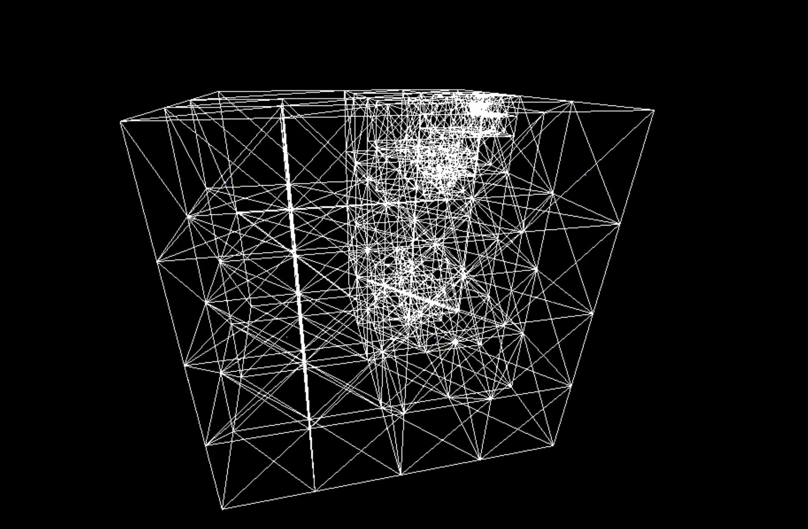

# Octree Implementation With Javascript, visualised by three.js

1452735 Mingjie Ma

Tutored by Jinyuan Jia

## Background

This is to complete the second assignment of Computer Graphics course of SSE, Tongji University 2018 Spring. The course assignment asks for an implementation (or optionally visualized) of the Octree algorithm. The so-called  octree algorithm acquired its name by adding 'tree' to the prefix 'oct'. In this structure, each node has eight children or none. It is used to divide space in Graphics rendering. When searching for a particular object in space, a structure like octree can be much faster than brute forcing. 

## More

The program uses Node.js for package management, browserify for bowser bundling. Make sure you have these if you do not wish to deploy them on a server.

## Outline

The application generates a certain amount of dots in space, and insert them into the octree.

The algorithm maintains a tree structure. It automatically expands its nodes when new points are inserted. The point will be placed in one of the child nodes according to its relative position to the origin (the center) of the cubic space underlying that node.

This implementation is based on the implementation by [brandonpelfrey](https://github.com/brandonpelfrey)

His is written in C++, and does not have a visualization. I rewrite the program in Javascript, and add a visualization using three.js

See references.

## Programs

Codes are well commented. See comments.

## Result

Since antialiasing is turn off. The result might seem a little bit blurry, and looks something like this, depending on the random points generated.

## References

https://github.com/brandonpelfrey/SimpleOctree

https://en.wikipedia.org/wiki/Octree

https://www.gamedev.net/articles/programming/general-and-gameplay-programming/introduction-to-octrees-r3529/

